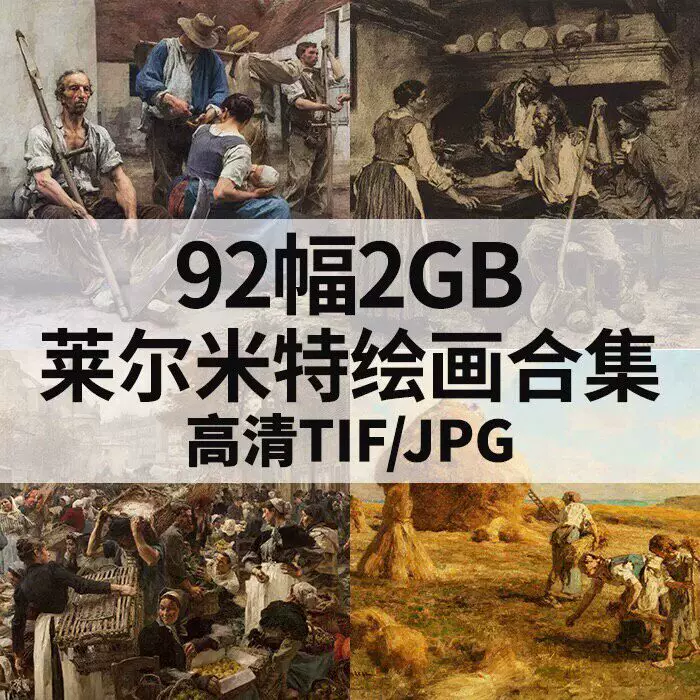
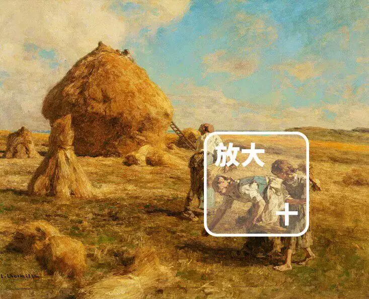
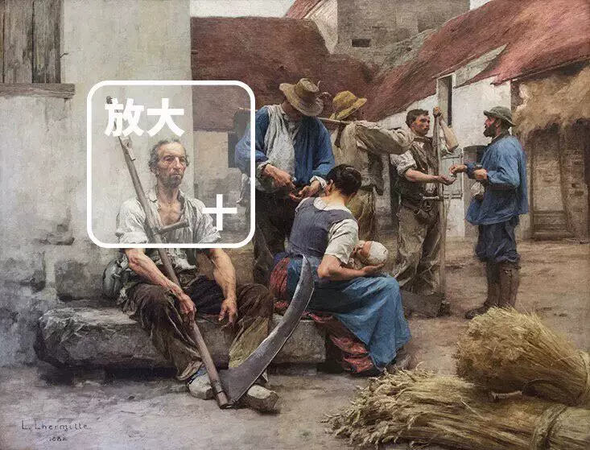
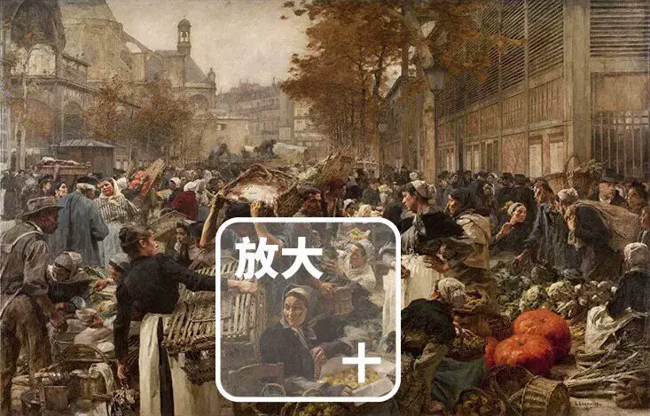
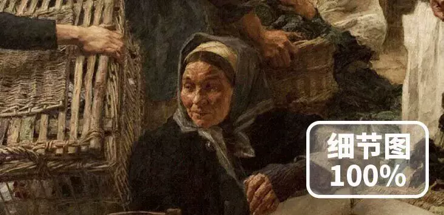
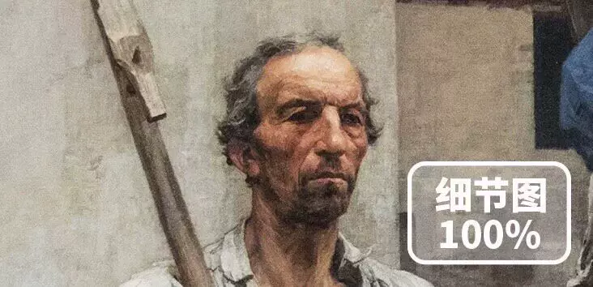
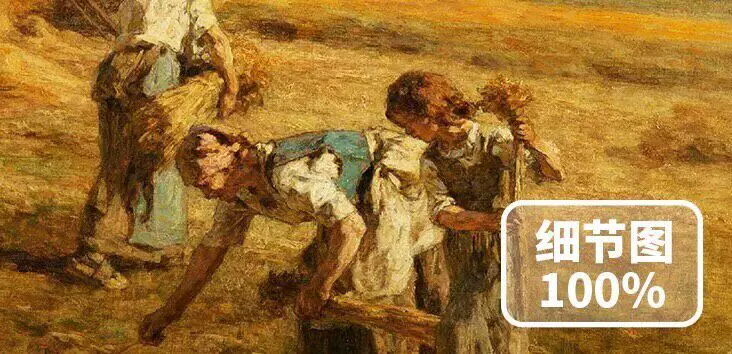

# 【Instant Download】Lehmett Oil Painting Collection - High Definition Western Countryside Scenery and Figures for Copying

This collection includes a variety of high-definition oil paintings by Lehmett, showcasing the beauty of western countryside landscapes and figures. These works are perfect for copying and can be used as reference materials for students who are interested in fine arts. The images are carefully selected to provide a wide range of styles and techniques, allowing you to explore different artistic expressions. Whether you are a beginner or an experienced artist, this collection will help you improve your skills and create stunning artworks.

## Body

【Instant Download】Lehmett Oil Painting Collection High Definition Western Countryside People and Landscape Still Life for Copying

This is a collection of high-definition western countryside landscapes, featuring people and scenery still life. It includes various scenes such as pastoral landscapes, rural villages, farmhouses, cows, horses, sheep, etc. The paintings are in high resolution, making them easy to copy and study.

(Full product description was not available from the source page.)

## Images

## Payment

Here is a pay link on Stripe ( https://buy.stripe.com/3cs8yP7sY87d0vu9AB ). Please contact me lonlonago@foxmail.com after funding $89, and I will send you a complete data files , thank you!

